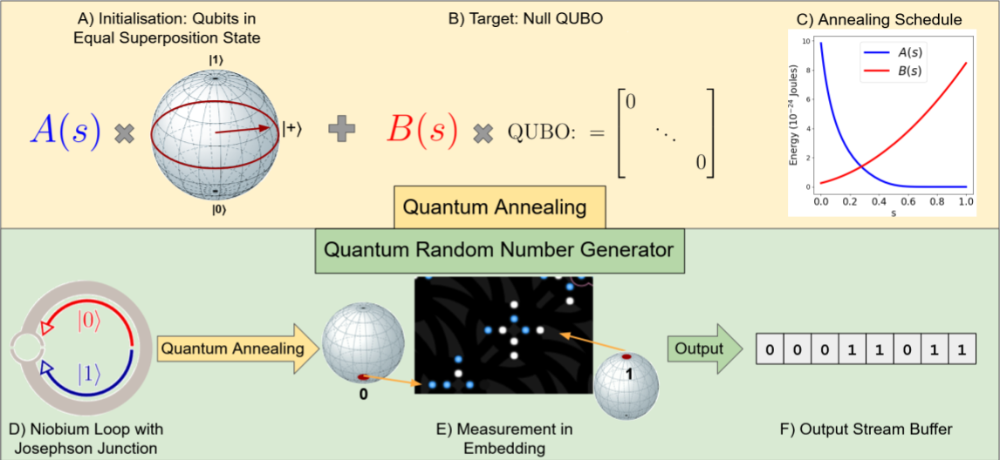

# Generation of Truly Random Numbers on a Quantum Annealer
[Paper]() | 
[Code](https://github.com/HarshilBhatia/QRNG) | 
[Project Page](https://4dqv.mpi-inf.mpg.de/QRNG/)


This is the code for the experiments in the IEEE Access publication 'Generation of Truly Random Numbers on a Quantum Annealer'.

## Running the Code
The code can be executed directly on D-Wave's Leap IDE: https://www.dwavesys.com/take-leap or locally by installing D-Wave Ocean: https://docs.ocean.dwavesys.com/en/stable/.

### Installation
If running the code locally, we recommend the user to create a virtual environment (optionally using conda)

```
conda env create -n ocean
pip install dwave-ocean-sdk
```

### Unbiased Random Number Generation
To generate 990,000 raw bits from the Advantage Architecture run the following code:
```
python unbiased_qrng.py --qpu --N 4950 --samples 200 --arch ADV
```

## Random Numbers 
We provide large sets of generated unbiased and biased random numbers [here](https://4dqv.mpi-inf.mpg.de/QRNG/) 

## Citation 
If you find our work useful in your research, please consider citing:

```
@article{bhatia2022qrng,
 title = {Generation of Truly Random Numbers on a Quantum Annealer},
 author = {Bhatia, Harshil and Tretschk, Edith and Theobalt, Christian and Golyanik, Vladislav },
 journal = {IEEE Access},
 year = {2022},
 volume = {},
 pages= {},
}
```
## License
Permission is hereby granted, free of charge, to any person or company obtaining a copy of this software and associated documentation files (the "Software") from the copyright holders to use the Software for any non-commercial purpose. Publication, redistribution and (re)selling of the software, of modifications, extensions, and derivates of it, and of other software containing portions of the licensed Software, are not permitted. The Copyright holder is permitted to publically disclose and advertise the use of the software by any licensee.

Packaging or distributing parts or whole of the provided software (including code, models and data) as is or as part of other software is prohibited. Commercial use of parts or whole of the provided software (including code, models and data) is strictly prohibited. Using the provided software for promotion of a commercial entity or product, or in any other manner which directly or indirectly results in commercial gains is strictly prohibited.

THE SOFTWARE IS PROVIDED "AS IS", WITHOUT WARRANTY OF ANY KIND, EXPRESS OR IMPLIED, INCLUDING BUT NOT LIMITED TO THE WARRANTIES OF MERCHANTABILITY, FITNESS FOR A PARTICULAR PURPOSE AND NONINFRINGEMENT. IN NO EVENT SHALL THE AUTHORS OR COPYRIGHT HOLDERS BE LIABLE FOR ANY CLAIM, DAMAGES OR OTHER LIABILITY, WHETHER IN AN ACTION OF CONTRACT, TORT OR OTHERWISE, ARISING FROM, OUT OF OR IN CONNECTION WITH THE SOFTWARE OR THE USE OR OTHER DEALINGS IN THE SOFTWARE.
n a Quantum Annealer'.
